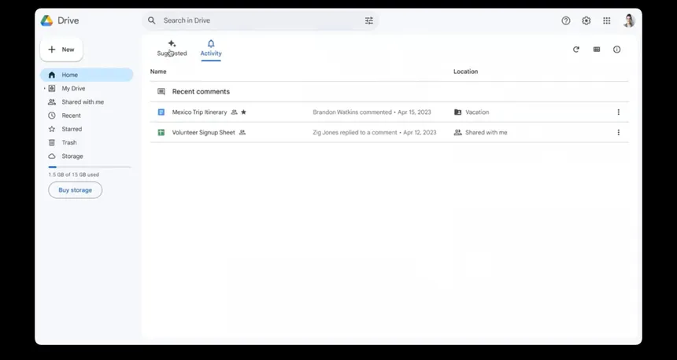

---

## 📁 `README.md`

```markdown
# 🚀 Google Drive Clone

A **Google Drive Clone** built using **React** and **Firebase** that allows users to sign up, sign in, create folders, and upload files in a cloud-based storage UI—just like Google Drive!

 <!-- Optional: Add a screenshot of your app here -->

---

## 🔧 Tech Stack

- ⚛️ **React** – Frontend framework
- 🔥 **Firebase** – Auth, Firestore (database), and Storage
- 📦 **Custom Hooks & Context API** – For clean state management
- 🧭 **React Router** – Page navigation
- 📁 **Modular Structure** – Clean component-based layout

---

## 📂 Project Structure

```plaintext

project-root/
├── public/
│   ├── favicon.ico
│   ├── index.html
│   └── ...
├── src/
│   ├── components/
│   │   ├── authentication/       # Login/Signup logic
│   │   └── google-drive/         # Folder/File UI
│   ├── contexts/
│   │   └── AuthContext.js        # Firebase Auth context
│   ├── hooks/
│   │   ├── firebase.js           # Firebase config
│   │   ├── useFolder.js          # Folder management logic
│   │   └── index.js              # App entry
│   ├── App.js                    # Main App component
├── .env                          # Firebase credentials (not committed)
├── .gitignore
├── package.json
└── README.md

````

---

## 🔐 Firebase Configuration

Create a `.env` file in your project root and add your Firebase config like this:

```env
REACT_APP_FIREBASE_API_KEY=your_api_key
REACT_APP_FIREBASE_AUTH_DOMAIN=your_project_id.firebaseapp.com
REACT_APP_FIREBASE_DATABASE_URL=https://your_project_id.firebaseio.com
REACT_APP_FIREBASE_PROJECT_ID=your_project_id
REACT_APP_FIREBASE_STORAGE_BUCKET=your_project_id.appspot.com
REACT_APP_FIREBASE_MESSAGING_SENDER_ID=your_sender_id
REACT_APP_FIREBASE_APP_ID=your_app_id
````

> ⚠️ **Never share `.env` or push it to GitHub.**

---

## 📦 Installation & Setup

```bash
# 1. Clone the repo
git clone this
cd google-drive-clone

# 2. Install dependencies
npm install

# 3. Add your Firebase config to .env

# 4. Start the development server
npm start
```

---

## ✨ Features

* 🔐 User Authentication (Signup, Login, Logout)
* 📂 Create and manage folders (Nested folders supported)
* 📤 Upload and list files
* 🌐 Real-time sync with Firebase Firestore & Storage
* 🧠 Custom hook for folder navigation (`useFolder`)
* 💡 Clean UI & folder-based layout

---

## 🚀 Deployment

You can deploy the app using:

* [Vercel](https://vercel.com/)
* [Firebase Hosting](https://firebase.google.com/docs/hosting)

---

## 🧪 Available Scripts

| Command         | Description                            |
| --------------- | -------------------------------------- |
| `npm start`     | Start development server               |
| `npm run build` | Build the app for production           |
| `npm test`      | Run tests                              |
| `npm run eject` | Eject from Create React App (optional) |

---

## 📚 Learn More

* [React Documentation](https://reactjs.org/)
* [Firebase Docs](https://firebase.google.com/docs)
* [Create React App Docs](https://create-react-app.dev/)


## 📄 License

This project is licensed under the [MIT License](LICENSE).

```
```
